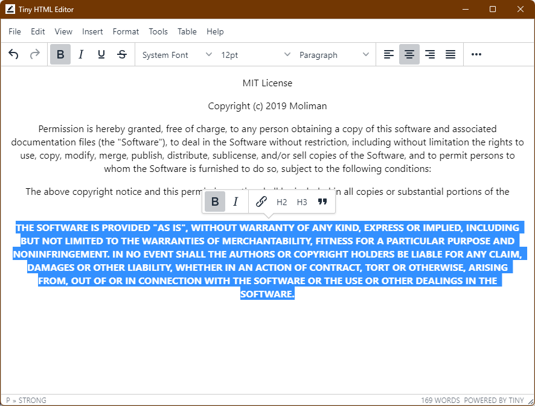

# Tiny HTML Editor

A lightweight HTML editor built with Electron and TinyMCE that provides a rich text editing experience with a clean interface.



## Features

- Rich text editing with TinyMCE 5
- File operations (Open, Save, Save As)
- HTML beautification on save
- Full screen editing mode
- Support for images, tables, and media
- HTML code view and preview
- Cross-platform support (Windows, macOS, Linux)

## Installation

```sh
# Clone the repository
git clone https://github.com/abbychau/tinymce-htmleditor

# Install dependencies
npm install
```

## Development

To run the application in development mode:

```sh
npm start
```

## Building

Build for your specific platform:

```sh
# Windows
npm run build-win

# macOS
npm run build-mac

# Linux
npm run build-linux
```

## License

This project is licensed under the MIT License - see the [LICENSE.md](LICENSE.md) file for details.

## Credits

- [Electron](https://www.electronjs.org/)
- [TinyMCE](https://www.tiny.cloud/)
- [js-beautify](https://github.com/beautify-web/js-beautify)
